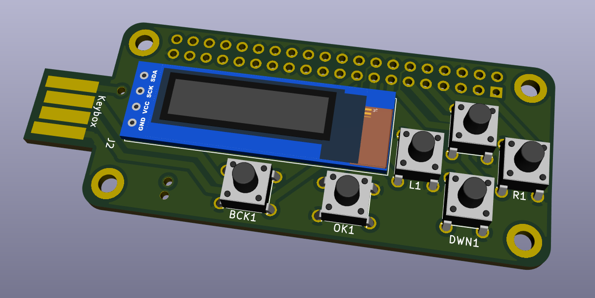

# KeyBox

## Équipe

- Antoine VERSMESSEN
- Clément DUQUENNE
- Édouard DANSETTE
- Sébastien WILLEMETZ
- Thibault DESPREZ

## Idées

*gestionnaire de mot de passe physique*

- Utiliser un raspi 0w si possible + usb board
- Écran
    - Oled
- Authentification 
    - Boutons 
    - Lecteur d'empreintes
- Navigation 
    - Boutons

On branche le raspi sur un pc ou un tel pour entrer le mot de passe en auto

Ajout des mots de passe par wifi et/ou physique

Stockage des mots de passe chiffré dans un Json

