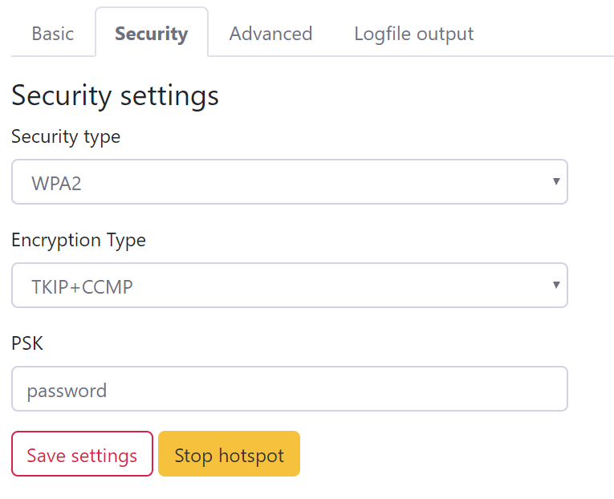

 # Installation de KeyBox

## Initialisation

```bash
sudo raspi config
# change local and keyboard layout 
# enable i2c and GPIO
sudo apt-get update
sudo apt-get dist-upgrade
sudo reboot
```


## Module à installer

``` bash
sudo apt install python3-pip git python3-pillow
sudo pip3 install rpi.gpio Adafruit_GPIO Adafruit_SSD1306 pillow

```


## Config hotspot

https://github.com/billz/raspap-webgui

```bash
curl -sL https://install.raspap.com | bash
reboot
```

```bash
sudo nano /etc/hostapd/hostapd.conf
```

retirer les commentaires et config le conrtycode et le ssid ainsi que le wpa_passphrase

```bash
reboot
```

se connecter au réseau et aller sur l'adresse ip 10.3.141.1

se connecter avec 

`user : admin`

`password : secret`

changer dans config hotspot 

onglet sécurité :arrow_forward:



```bash
sudo systemctl disable lighttpd
sudo systemctl disable raspap 
reboot
```

## Install Keybox

```bash
git clone https://github.com/kaetir/KeyBox
```

